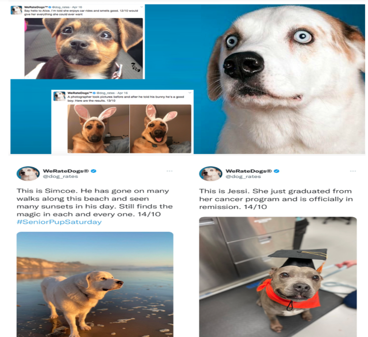
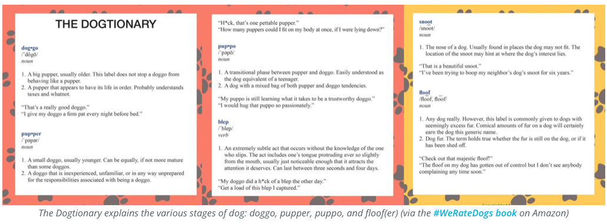

  
   
  <em>Udacity Data Analyst Nanodegree</em>

<h1>Project: Wrangle and Analyze WeRateDogs Twitter Archive</h1>
<h2>Table of Content</h2>
<ul>
    <li><a href="#intro">Introduction</a></li>
    <li><a href="#softwares">What Softwares Do I Need?</a></li>
    <li><a href="#motivation">Project Motivation</a></li>
    <li><a href="#details">Project Details</a></li>
      <ul>
            <li><a href="#gathering">Gathering Data</a></li>
            <li><a href="#assessing">Assessing Data</a></li>
            <li><a href="#cleaning">Cleaning Data</a></li>
            <li><a href="#storing">Storing, Analyzing, and Visualizing Data</a></li>
        </ul>
    <li><a href="#report">Report</a></li>
    <li><a href="#reference">References</a></li>
</ul>

<h2>Introduction</h2>

Real-world data rarely comes clean. Using Python and its libraries, I will gather data from a variety of sources and in a variety of formats, assess its quality and tidiness, then clean it. This is called data wrangling. I will document your wrangling efforts in a Jupyter Notebook, plus showcase them through analyses and visualizations using Python (and its libraries) and/or SQL.  

The dataset that I will be wrangling (and analyzing and visualizing) is the tweet archive of Twitter user [@dog_rates](https://twitter.com/dog_rates), also known as [WeRateDogs](https://en.wikipedia.org/wiki/WeRateDogs). WeRateDogs is a Twitter account that rates people's dogs with a humorous comment about the dog. These ratings almost always have a denominator of 10. The numerators, though? Almost always greater than 10. 11/10, 12/10, 13/10, etc. Why? Because "[they're good dogs Brent](https://knowyourmeme.com/memes/theyre-good-dogs-brent)." WeRateDogs has over 4 million followers and has received international media coverage.

WeRateDogs [downloaded their Twitter archive](https://help.twitter.com/en/managing-your-account/how-to-download-your-twitter-archive) and sent it to Udacity via email exclusively for you to use in this project. This archive contains basic tweet data (tweet ID, timestamp, text, etc.) for all 5000+ of their tweets as they stood on August 1, 2017. More on this soon.

  

<h2>What Softwares Do I Need?</h2>

The following softwares and packages (libraries) are required for this project:
- Softwares
  - Jupyter Notebook
  - Microsoft Word
  - [Google Docs](https://www.google.com/docs/about/)
- Packages (Libraries)
  - pandas
  - NumPy
  - matplotlib
  - seaborn
  - requests
  - tweepy
  - json
   

<h2>Project Motivation</h2>

<h3>Context</h3>
My goal for this project is to wrangle WeRateDogs Twitter data to create interesting and trustworthy analyses and visualizations. The Twitter archive is great, but it only contains very basic tweet information. Additional gathering, then assessing and cleaning is required for "Wow!"-worthy analyses and visualizations. 
<h3>The Data</h3>

<h4>Enhanced Twitter Archive</h4>

The WeRateDogs Twitter archive contains basic tweet data for all 5000+ of their tweets, but not everything. One column the archive does contain though: each tweet's text, which Udacity used to extract rating, dog name, and dog "stage" (i.e. doggo, floofer, pupper, and puppo) to make this Twitter archive "enhanced." Of the 5000+ tweets, Udacity filtered for tweets with ratings only (there are 2356).

Udacity extracted this data programmatically, but didn't do a very good job. The ratings probably aren't all correct. Same goes for the dog names and probably dog stages (see below for more information on these) too. I'll need to assess and clean these columns in order to use them for analysis and visualization.

<h4>Additional Data via the Twitter API</h4>

Back to the basic-ness of Twitter archives: retweet count and favorite count are two of the notable column omissions. Fortunately, this additional data can be gathered by anyone from Twitter's API. Well, "anyone" who has access to data for the 3000 most recent tweets, at least. But me, because I have the WeRateDogs Twitter archive and specifically the tweet IDs within it, can gather this data for all 5000+. And guess what? I'm going to query Twitter's API to gather this valuable data.

<h4>Image Predictions File</h4>

One more cool thing: Udacity ran every image in the WeRateDogs Twitter archive through a [neural network](https://www.youtube.com/watch?v=2-Ol7ZB0MmU) that can classify breeds of dogs*. The results: a table full of image predictions (the top three only) alongside each tweet ID, image URL, and the image number that corresponded to the most confident prediction (numbered 1 to 4 since tweets can have up to four images).

So for the last row in that table:

- tweet_id is the last part of the tweet URL after "status/" →
  https://twitter.com/dog_rates/status/889531135344209921
- p1 is the algorithm's #1 prediction for the image in the tweet → __golden retriever__
- p1_conf is how confident the algorithm is in its #1 prediction → __95%__
- p1_dog is whether or not the #1 prediction is a breed of dog → __TRUE__
- p2 is the algorithm's second most likely prediction → __Labrador retriever__
- p2_conf is how confident the algorithm is in its #2 prediction → __1%__
- p2_dog is whether or not the #2 prediction is a breed of dog → __TRUE__
- etc.

And the #1 prediction for the image in that tweet was spot on:

  

So that's all fun and good. But all of this additional data will need to be gathered, assessed, and cleaned. This is where I come in.

<h2>Project Details</h2>

<h3>Gathering Data</h3>

In this step, I will gather all three pieces of data as described in the "Data Gathering" section in the `wrangle_act.ipynb` notebook.

__Note:__ the methods required to gather each data are different.

<h3>The WeRateDogs Twitter archive</h3>
Udacity gave this file to me, so imagine it as a file on hand. Downloaded this file manually by clicking the following link:

[`twitter_archive_enhanced.csv`](https://d17h27t6h515a5.cloudfront.net/topher/2017/August/59a4e958_twitter-archive-enhanced/twitter-archive-enhanced.csv).

Once it is downloaded, I uploaded it and read the data into a pandas DataFrame.

<h4>The tweet image predictions</h4>

This file (`image_predictions.tsv`) is present in each tweet according to a neural network. It is hosted on Udacity's servers and should be downloaded programmatically using the [Requests](https://pypi.org/project/requests/) library and the following URL: https://d17h27t6h515a5.cloudfront.net/topher/2017/August/599fd2ad_image-predictions/image-predictions.tsv

<h4>Additional data from the Twitter API</h4>

Gather __each tweet's retweet count__ and __favorite ("like") count__ at the minimum and any additional data you find interesting. Using the tweet IDs in the WeRateDogs Twitter archive, query the Twitter API for each tweet's JSON data using Python's [Tweepy](http://www.tweepy.org/) library and store each tweet's entire set of JSON data in a file called `tweet_json.txt` file.

Each tweet's JSON data should be written to its own line. Then read this .txt file line by line into a pandas DataFrame with (at minimum) __tweet ID, retweet count, and favorite count__. 

_Note: do not include your Twitter API keys, secrets, and tokens in your project submission._

